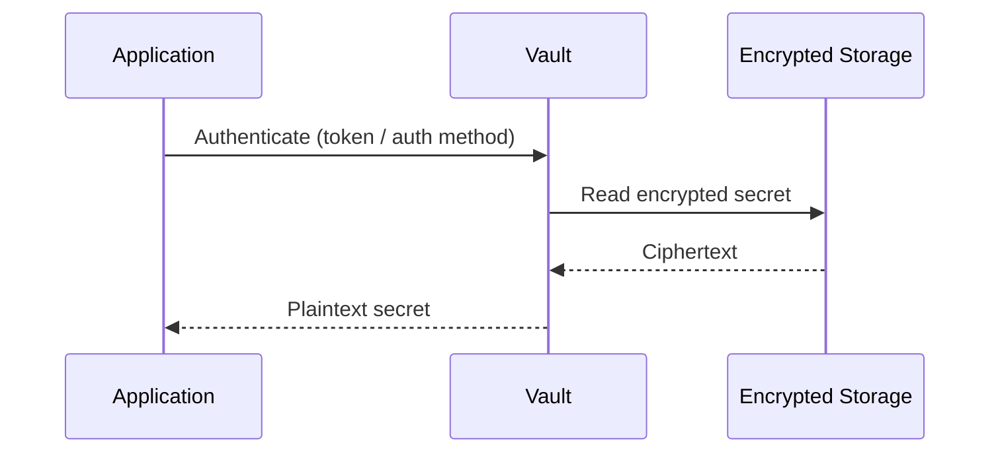
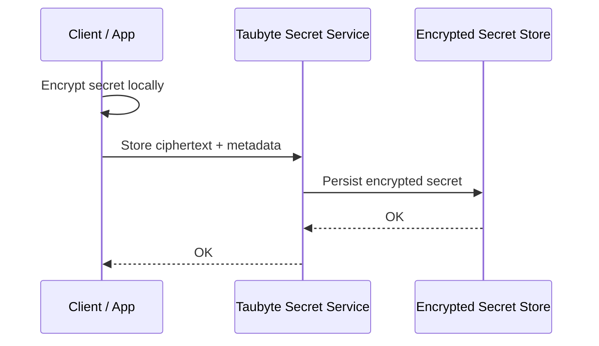
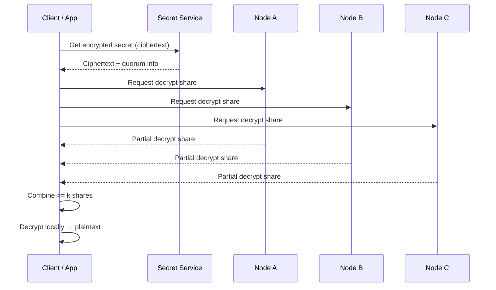
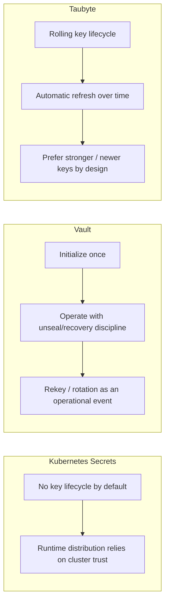

Secret management used to be a mostly solved problem. You picked a system, stored secrets, added policies, rotated keys occasionally, and moved on.

But the environment around secrets has changed faster than most security models did.

Two shifts are driving that change:

1. **Everything is distributed now**: multi-node, multi-region, constant churn, ephemeral workloads.
2. **Secrets are consumed continuously**: by automation, microservices, agents, and toolchains.

The rise of **AI agents** and **agentic workflows** amplifies both shifts:

- Secrets get fetched more often (and repeatedly)
- Workflows fan out and retry automatically
- Tool calls chain across components you don’t fully control
- Temporary state tends to become permanent (logs, caches, artifacts, traces)
- The speed of failure is now minutes, not weeks

So the old secret-management question, *"Who is allowed to read the secret?"*, stops being the useful one.

The question that matters is:

> **Who is cryptographically capable of ever seeing plaintext?**

Because wherever plaintext exists, it can be logged, scraped from memory, accessed through debugging, exposed by misconfiguration, or exfiltrated after compromise.

As autonomy increases, "least privilege" helps, but it doesn’t save you if plaintext exists in too many places.

---

## The mental model: trust boundaries, not feature sets

The easiest way to get misled in security is to compare tools by feature count.

Secret systems tend to look similar on paper:
- store a secret
- retrieve a secret
- rotate a secret
- apply policy

But the *defining difference* between them is **where the trust boundary is drawn**.

A secret system is really a statement about what you’re willing to trust:

- **Admin-trusted systems** assume privileged humans and infrastructure are trusted.
- **Process-trusted systems** assume the *right service* can safely handle plaintext.
- **Crypto-trusted systems** assume infrastructure is hostile and design plaintext out of the platform.

Once you see it this way, secret management becomes a **risk + operational tradeoff decision**, not a product decision.

---

## The comparison that actually matters

This isn’t a feature checklist. It’s a threat-model comparison: **where plaintext can exist, what breaks confidentiality, and how big the blast radius is.**

| Dimension | **Taubyte** | **HashiCorp Vault** | **Kubernetes Secrets** |
|---|---|---|---|
| **Trust model** | Crypto-trusted (servers can’t decrypt) | Process-trusted | Admin-trusted |
| **Where plaintext can exist** | Client boundary only | Vault server memory | Control plane, nodes, and pods |
| **Server can read secrets** | ✅ No (by design) | ❌ Yes (transient) | ❌ Yes |
| **Operator can read secrets** | ✅ No | Possible with privilege/compromise | ❌ Yes (by design) |
| **Key creation / rotation** | Continuous + automatic | Init + operational rekey | None by default |
| **Operational ceremony** | Low ceremony (hands-off lifecycle) | Medium/High (init/unseal discipline + policy hygiene) | Low (but weakest trust model) |
| **What breaks confidentiality** | Client compromise **or** threshold compromise + ciphertext access | Process/host compromise or privileged token | Cluster admin/node/pod compromise |
| **Impact (who is affected)** | **Bounded per secret** | Potentially all secrets | Often cluster-wide |

If you only internalize one row, make it this one:

> **Where plaintext can exist.**

That’s the whole game.

---

## A simple map of plaintext exposure

This is the cleanest way I know to explain the difference.

```mermaid
flowchart LR
  subgraph K8S["Kubernetes Secrets"]
    K1[Control Plane] --> K2[Node / Kubelet]
    K2 --> K3[Pod Runtime]
    K3 --> K4[Application]
    K4 --> K5[Plaintext exists across multiple boundaries]
  end

  subgraph VAULT["Vault"]
    V1[Encrypted Storage] --> V2[Vault Server Process]
    V2 --> V3[Application]
    V3 --> V4[Plaintext exists in Vault + client]
  end

  subgraph TAU["Taubyte"]
    T1[Encrypted Secret Store] --> T2[Nodes return crypto shares]
    T2 --> T3[Client reconstructs secret]
    T3 --> T4[Plaintext exists only client-side]
  end
````

---

# Model 1: Kubernetes Secrets (admin-trusted, broad exposure)

Kubernetes Secrets are popular because they’re convenient and native.

But in risk terms, Kubernetes Secrets are fundamentally:

> **A mechanism to deliver sensitive configuration to workloads inside the cluster trust boundary.**

That can be perfectly fine, as long as you accept what it implies.

## How secrets flow in Kubernetes

This diagram is intentionally simplified, because the key point isn’t implementation. It’s **where plaintext shows up**.

```mermaid
sequenceDiagram
  participant Admin as Admin / CI
  participant API as kube-apiserver
  participant ETCD as etcd / storage
  participant Node as Node (kubelet)
  participant Pod as Pod / Container
  participant App as Application

  Admin->>API: Create/Update Secret
  API->>ETCD: Persist secret object
  Node->>API: Fetch secret for scheduled pod
  API-->>Node: Secret data
  Node-->>Pod: Mount / inject secret
  Pod-->>App: Env var / file read
```

## What breaks confidentiality in Kubernetes Secrets

Kubernetes Secrets break when the cluster boundary breaks:

* admin credential compromise
* node compromise
* overly permissive RBAC
* workload compromise with access to secrets
* debugging workflows that expose env/mounts

## Why the blast radius tends to be wide

Kubernetes is designed for **availability and orchestration**.

That’s great for running workloads, but it means:

* secrets are accessible in many places
* secrets are delivered to many pods
* nodes are involved by necessity
* privileged access is a normal operational tool

This doesn’t mean “never use Kubernetes Secrets.”

It means: **don’t pretend the model is cryptographically isolated.**
It’s admin-trusted by nature.

---

# Model 2: Vault (process-trusted, centralized decrypting authority)

Vault is a serious system used by serious teams.

It gives you:

* centralized policy and access control
* authentication integration
* audit trails
* rotation workflows
* dynamic secrets engines

It solves a major problem Kubernetes doesn’t solve well:

> **Reducing human access to secrets while adding governance.**

But Vault has one unavoidable property:

> If Vault returns plaintext to a client, plaintext must exist inside Vault at runtime.

That’s not an opinion. It’s physics.

## How secrets flow in Vault

This is the flow most teams run in production:



## What breaks confidentiality in Vault

Vault breaks when the decrypting authority is compromised:

* Vault host compromise
* Vault process compromise
* privileged token compromise
* policy/auth boundary failure

Vault reduces the number of humans who can retrieve secrets.
But it does **not** remove secrets from the server trust boundary.

## Why the blast radius can become large

Vault is usually a central service serving many workloads.

So compromise tends to have this shape:

* if the Vault process is compromised at runtime
* or a high-privilege token is obtained
* or the auth boundary is misconfigured

…impact can expand rapidly.

Again: Vault is an excellent tool.
But it’s a *process-trusted model*, not a cryptographic isolation model.

---

# Model 3: Taubyte (crypto-trusted, plaintext never exists server-side)

Taubyte starts with a different premise:

> Assume infrastructure gets compromised. Make that insufficient.

Instead of focusing on “who is allowed to decrypt,” Taubyte focuses on:

> **No server can decrypt at all, even if it wants to.**

## The core idea (without implementation details)

Taubyte uses distributed threshold cryptography:

* encrypt with a public key
* decryption requires **k-of-n** shares
* no single node can decrypt alone
* plaintext reconstruction happens **only at the client boundary**

## How storing a secret works in Taubyte

The biggest difference is *where encryption happens*.



The platform stores and coordinates encrypted material.
It never needs plaintext to function.

## How retrieving a secret works in Taubyte

Retrieval is where threshold changes everything:



### The trust boundary becomes obvious

* Nodes never produce plaintext
* Shares alone are not secrets
* Plaintext exists only in the client

That’s what “crypto-trusted” means in real operational terms.

---

## Key lifecycle: continuous vs one-time ceremony

This matters more than people admit.

Many security failures are not cryptographic failures. They’re lifecycle failures:

* key custody complexity
* rekey and recovery mishaps
* operational rituals executed under stress

This is where the models differ:

* Kubernetes: typically no dedicated key lifecycle by default
* Vault: init + unseal/recovery model, rekey is operational
* Taubyte: continuous rolling keys as part of normal operation

Here’s a simplified view of the lifecycle patterns:



The point isn’t “rotation exists.”
The point is **how dependent you are on humans doing ceremonies under pressure.**

---

# Threat model: what breaks confidentiality, and how bad is it?

This is where teams either sleep at night or don’t.

## Kubernetes Secrets

**Break condition:** compromise the cluster trust boundary

* admin access compromised
* node compromised
* workloads over-permissioned
* secrets visible through debug paths

**Impact:** often broad

* secrets widely available in runtime contexts

## Vault

**Break condition:** compromise the decrypting authority

* server/process compromise
* privileged token compromise
* auth boundary failure

**Impact:** can become broad quickly

* because the central service is capable of returning plaintext

## Taubyte

**Break condition:** compromise the only place plaintext exists (client),
or compromise threshold shares **and** access the target ciphertext.

**Impact:** naturally bounded per secret

* because ciphertext access matters
* and secret material is not centrally decryptable

A short way to say it:

> **Taubyte failure exposes a secret. Vault or Kubernetes failure can expose a system.**

---

# Why AI agents push this from “nice-to-have” to necessary

In agent-driven systems, secrets aren’t rare reads.
They become **background capabilities**.

A single agent workflow might:

* fetch an API credential
* call an internal tool via MCP
* retrieve a second token for a datastore
* call a third-party service
* retry on failure across different nodes/regions

That can happen **hundreds or thousands of times per hour**, with parallelism.

At that point, security failures look less like:

> “Someone intentionally stole the key”

…and more like:

> “The system touched plaintext in too many places, too often.”

So the strategic move isn’t only tighter policy.
It’s reducing plaintext exposure to the smallest possible boundary.

Taubyte does exactly that:
plaintext exists at the client boundary, not the server boundary.

---

# Availability vs confidentiality: the real trade you’re making

Every secret system balances:

* **Confidentiality** (who can learn secrets)
* **Availability** (who can use secrets reliably)

Kubernetes Secrets optimize availability by distributing secrets widely inside a trusted cluster.

Vault balances availability and governance with a centralized service.

Taubyte delivers high availability like the others, but it shifts the trust boundary so the platform can keep serving secrets without becoming a single point of decryption or a single point of compromise.

In the AI era, Taubyte is the winner, period.

---

# Choosing a model intentionally

You don’t pick a secret system because it’s “best.”
You pick it because it matches your threat model and operational reality.

### Choose Kubernetes Secrets when:

* secrets are low/medium value
* workloads are well-contained
* cluster admins and nodes are trusted
* you want the simplest native mechanism

### Choose Vault when:

* centralized policy and auditability are critical
* dynamic secrets matter
* you accept server-side plaintext handling as part of the model
* you can operate the platform with strong discipline

### Choose Taubyte when:

* you want infrastructure compromise to be a contained incident
* you want the platform to be incapable of decrypting secrets
* you expect secrets to be consumed continuously by automation and agents
* you want blast radius bounded per secret by design

---

## Closing thought

Secret management isn’t fundamentally about storage.
It’s about trust boundaries.

* **Kubernetes Secrets** → trust admins and nodes
* **Vault** → trust the process
* **Taubyte** → trust cryptography and keep plaintext client-side

As AI agents become normal in production workflows, the only direction that scales safely is the one that minimizes plaintext exposure.

> **Where plaintext lives determines your risk surface.**

Everything else is implementation detail.

